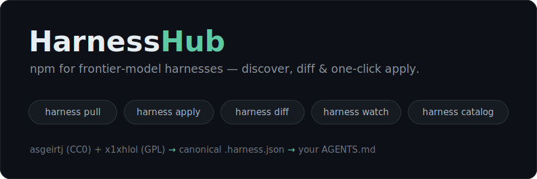

<p align="center">
  
</p>

<h1 align="center">HarnessHub</h1>

<p align="center">
  <b>npm for frontier-model harnesses.</b><br>
  Discover, diff, and <b>one-click apply</b> the leaked / extracted system prompts + tool-loops of
  frontier models (Opus 4.8, Fable, GPT-5.5, Gemini 3.x, Cursor, Devin…) into your own agent.
</p>

<p align="center">
  <a href="https://github.com/spikesubingrui-design/harnesshub/stargazers"></a>
  
  = 18">
  
  
  
</p>

---

Everyone collects leaked system prompts. **Nobody lets you *use* them.**

The big dumps ([x1xhlol ~140K★](https://github.com/x1xhlol/system-prompts-and-models-of-ai-tools), [asgeirtj ~42K★](https://github.com/asgeirtj/system_prompts_leaks)) are read-only museums — raw `.txt` you can stare at. HarnessHub turns them into a **package manager**: normalize any frontier harness into one canonical format, **diff** it across versions, **watch** it for silent vendor changes, and **apply** it into your own agent with one command.

> 🔒 This repo ships the **tooling only**. Verbatim third-party prompts are fetched at runtime and git-ignored — HarnessHub stores **provenance, not copies**. Unaffiliated with any vendor. See [LEGAL.md](LEGAL.md).

## Quickstart

```bash
git clone https://github.com/spikesubingrui-design/harnesshub
cd harnesshub && npm link            # zero deps; gives you the `harness` binary (Node >= 18)

# 1. pull real harnesses from an upstream and normalize them
harness pull --vendor Anthropic --filter opus-4.8

# 2. apply one into your agent (writes a fenced, revertible block to AGENTS.md)
harness apply harnesses/anthropic-claude-code/opus-4.8/*.harness.json --into ./AGENTS.md --yes

# 3. browse + diff + apply in a web UI
harness catalog && python3 -m http.server --directory web
```

## What it does

| command | what you get |
|---|---|
| `harness pull` | Ingest + normalize harnesses from multiple upstreams (asgeirtj `CC0`, x1xhlol `GPL`) into one canonical `.harness.json`. **Content-hash dedup** merges the same harness across sources. |
| `harness apply` | Compile a harness into `AGENTS.md` — read by 30+ agents, so one apply reaches your whole fleet. **Idempotent**, `--revert`-able, behind an approval preview that always shows provenance. |
| `harness diff` | Line- and tool-level diff between any two captures. Cross-version (`opus-4.6 → 4.8`) or cross-model. Turns fake "versions" into real changelogs. |
| `harness watch` | Re-check upstreams and **alert when a vendor silently changes a harness**, writing a changelog. The static archive becomes a live monitor. |
| `harness catalog` | Generate a browsable web UI — search, filter, side-by-side diff, and an `harness://` **Apply** button. |

## How it works

```
 upstreams ──pull──▶ normalize ──▶ canonical .harness.json ──apply──▶ AGENTS.md
 asgeirtj (CC0)      TOC strip,     one schema: identity,            (your whole
 x1xhlol  (GPL)      tool extract,  provenance, components,           agent fleet)
                     dedup, hash    tools — queryable + diffable
                          │
                          └──watch──▶ drift alerts + changelog
```

Pure logic (`normalize`, `compile`, `diff`) is separated from I/O (`pull`, `watch`, `catalog`) and fully unit-tested. The canonical format is [`schema/harness.schema.json`](schema/harness.schema.json) — see [an example](harnesses/_example.harness.json).

## How it compares

| | leaked-prompt repos | prompt platforms (LangSmith, Braintrust…) | **HarnessHub** |
|---|:--:|:--:|:--:|
| Aggregates leaked frontier harnesses | ✅ | ❌ | ✅ |
| Cross-model canonical schema | ❌ | ❌ | ✅ |
| Real version diff / drift alerts | ❌ | ~ (your prompts) | ✅ |
| **One-click apply into your agent** | ❌ | ❌ | ✅ |
| Provenance + takedown built in | ❌ | n/a | ✅ |

## Roadmap

- [x] Canonical `harness.schema.json` + `apply` to `AGENTS.md` (idempotent, revertible)
- [x] Multi-upstream `pull` (asgeirtj + x1xhlol) with content-hash dedup
- [x] `harness diff` (cross-version / cross-model)
- [x] `harness watch` — drift detection + changelog
- [x] Web catalog — browse · filter · side-by-side diff · `harness://` apply
- [ ] More upstreams: jujumilk3 → CL4R1T4S
- [ ] Per-target adapters: `--target claude-code` / `--target cursor`
- [ ] `harness://` desktop protocol handler (catalog Apply → local CLI)
- [ ] LLM-assisted normalization: cross-model component bucketing + summaries
- [ ] `harness watch` as a scheduled GitHub Action + notifications

See [docs/STRATEGY.md](docs/STRATEGY.md) for the market thinking behind the design.

## Legal

HarnessHub is **not affiliated with or endorsed by any model vendor**. It indexes third-party prompts extracted by the community, for research and interoperability, and stores provenance rather than redistributing verbatim content in this repository. Every entry carries a takedown id. See [LEGAL.md](LEGAL.md).

## Contributing

PRs welcome — especially new upstream sources and apply targets. Adding a source is ~10 lines. See [CONTRIBUTING.md](CONTRIBUTING.md).

## License

[MIT](LICENSE) (tooling only). Vendor prompts remain the property of their owners.
